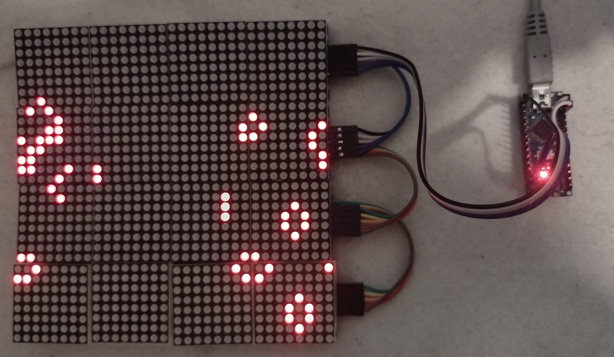
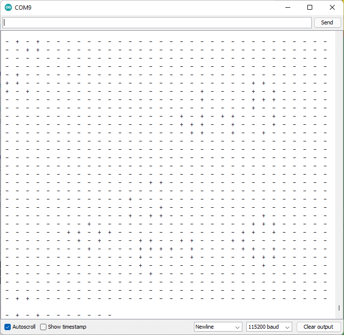
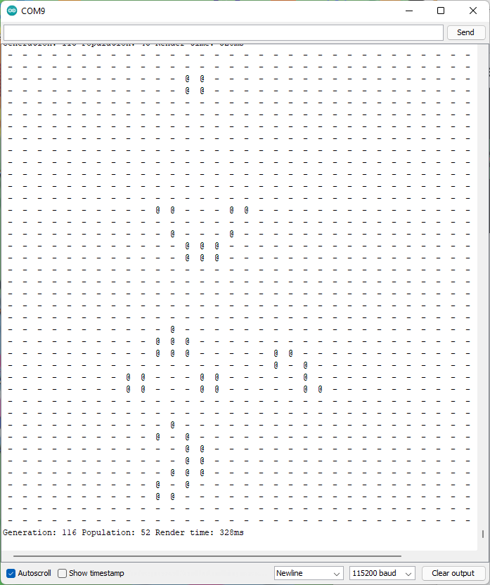
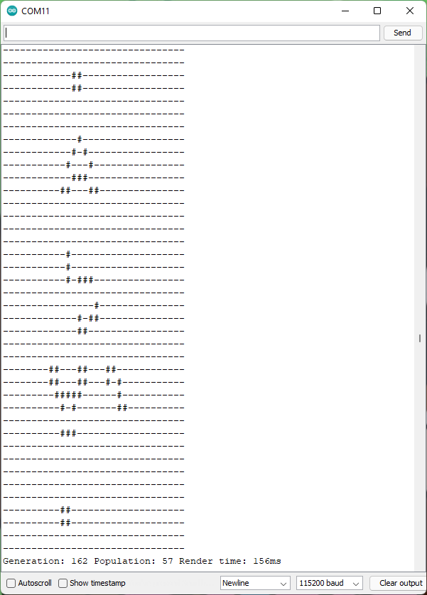
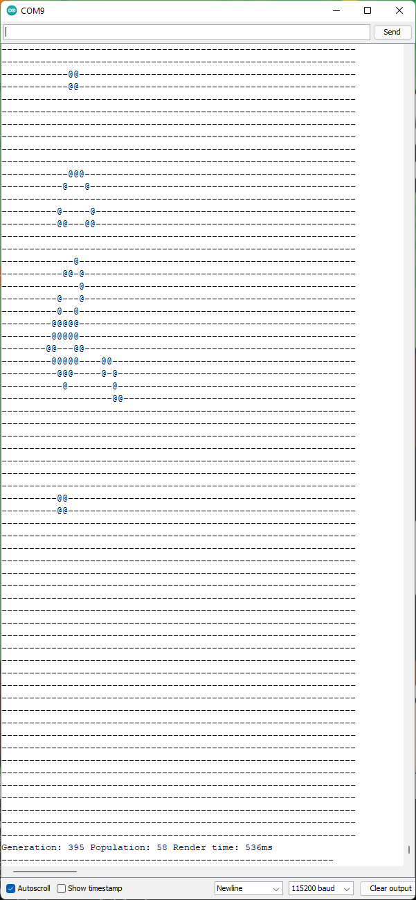
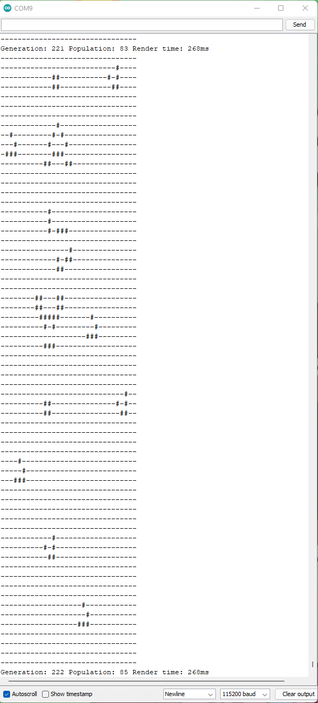
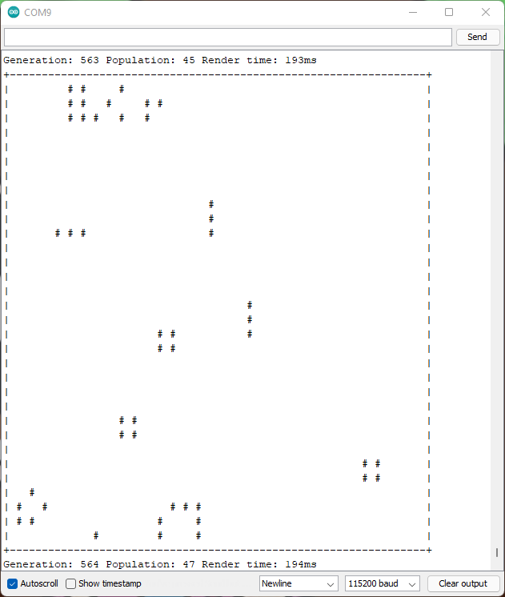

# Conway's Game of Life

A simple Arduino sketch for Conway's Game of Life.

The goal was to be somewhat light on memory using a bitfield.

Serial branch Uses 1 frame buffer + 3 Line buffers (this can be cut down to 2 if a close topology is needed).

Master is intended to work with 4 FC16 MAX72XX boards.





## Settings

Code is hopefully self explanatory but:


0. If it's not hooked up to a 32x32 LED matrix of the MAX72* type enable `USE_SERIAL` to get the output over the serial port.
1. First decide on a topology and set `get_state` to point to either `get_state_wrapped` or `get_state_closed` (or define your own).
2. Decide on initial conditions in `setup` randomize, a glider... both?
3. You can change string printed for living or dead cells with `LIVE` and `DEAD`.
4. `USE_GENERATION_LIMIT` and `GENERATION_LIMIT` resets after a set number of generations
5. `USE_STALE_LIMT` and `STALE_LIMIT` resets if population hasn't changes for a number of generations
6. `ROWS` can be changed.
7. `COLS` **shouldn't** be changed, instead you could change the type of state to be an array of unsigned int or unsigned char. Default is `unsigned long` (32), but you could pick `unsigned long long` (64), `unsigned int` (16), `unsigned char` (8)... whatever you like!
8. `USE_STATS` controls if stats are printed.

## Performance

Slowest part of the code is (of course) printing to the Serial output. Using a short string for living and dead states is the biggest perforamnce improvement I've seen so far. Even better than buffering the print (which probably happens anyways).

Other speed ups like unrolling the inner loop, amortizing the sum into coloums, using the buffer as an `unsigned long[]` to copy up to 4bytes a time don't seem particularly useful. Probably because `avr-gcc` is smarter than me.

Even 64x64 runs okay with serial printing seeming to be the biggest bottle neck. Also this is provided by `avr-gcc` and I can't get it to work reliably...

## Memory usage

On the cheapest arduino clone board I can find labelled only "nano" here is the Arduino IDE output for the Gosper Gun demo on a 32x40 board with wrapping topology, as seen above.

Builds below include MD_MAX72XX library and avr-gcc support for long and long long arithmetic.

### 32x40

Big enough for a Gosper Gun.

```
Sketch uses 9142 bytes (29%) of program storage space. Maximum is 30720 bytes.
Global variables use 242 bytes (11%) of dynamic memory, leaving 1806 bytes for local variables. Maximum is 2048 bytes.
```

Every other implementation I've seen would use 32*40 bytes for a single frame buffer. A stonking 1280 bytes alone. Of the ones I tested (stripping away printing) all had circa 4KB globals.

### 64x64 (uses avr-gcc unsigned long long)
```
Sketch uses 9360 bytes (30%) of program storage space. Maximum is 30720 bytes.
Global variables use 606 bytes (29%) of dynamic memory, leaving 1442 bytes for local variables. Maximum is 2048 bytes.

```

## Branches

* `master` - the one you want for up to date code
* `print_buffer` - using buffered print - no benefit.
* `unroll` - Unrolling the inner loop and manually reducing some calculations - no benefit
* `border` - Print a silly border around it.
* `64bit` - The 64x64 version using avr-gcc extension
* `Serial` - Serial output

## Screenshots
.

.

.

Printing less bytes improves render time (as it's spending less waiting on the serial port).



A 64x64 version looks good but there is a bug as I can't see how avr-gcc bodges long long to manage movement.



You can see that wrapping topology means this Gosper gun gets about 8 gliders out before it hits itself.



L33t h4x0r border.