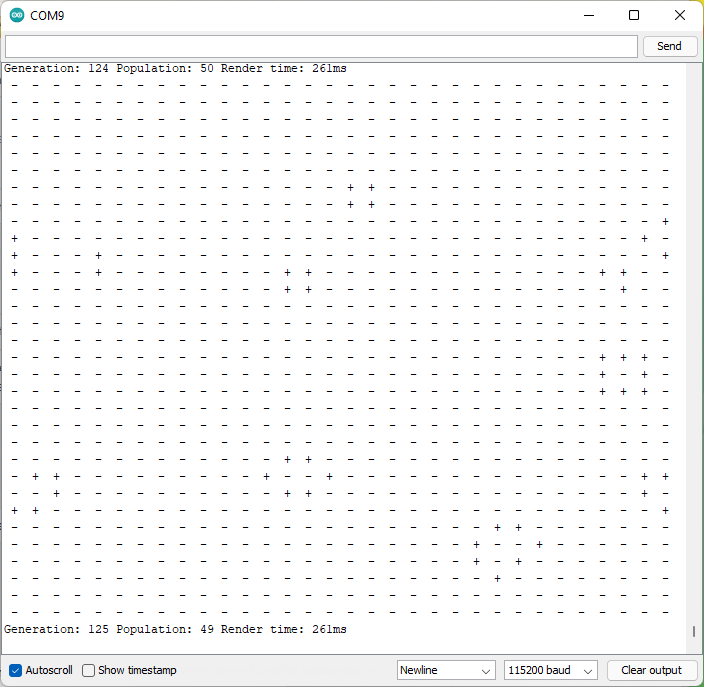

# Conway's Game of Life

A simple Arduino sketch for Conway's Game of Life.

The goal was to be somewhat light on memory using a bitfield.

Serial branch Uses 1 frame buffer + 3 Line buffers (this can be cut down to 2 if a close topology is needed).

Master is intended to work with 4 FC16 MAX72XX boards.


## Settings

Code is hopefully self explanatory but:

| Setting      | Description |
| ----------- | ----------- |
| USE_SERIAL      | Output over Serial Port      |
| USE_LED   | Output to LED matrix        |
| get_state | `get_state_wrapped` or `get_state_closed` (or specify your own) |
| Initialize | Randomly? Or with a glider? |
| LIVE/ DEAD | String for Serial output |
| USE_GENERATION_LIMIT | Reset after `GENERATION_LIMIT` steps |
| USE_STALE_LIMIT | Reset if population doesn't change in `STALE_LIMIT` steps |
| ROWS | The number of rows to use |
| state | Change the type of state to change number of columns, if changed to uint64_t you need to change other instances of uint32_t to match |
| USE_STATS | Print STATS over Serial output (enable USE_SERIAL)! |

## Performance

The Serial output is slow even at 115200 baud making it take about 261ms to update and output a frame.

LED output is very fast <50ms per update allowing.

## Memory usage (serial and LED output disabled)

```
Sketch uses 2000 bytes (6%) of program storage space. Maximum is 30720 bytes.
Global variables use 159 bytes (7%) of dynamic memory, leaving 1889 bytes for local variables. Maximum is 2048 bytes.
```


## Screenshots
.

.


L33t h4x0r border.